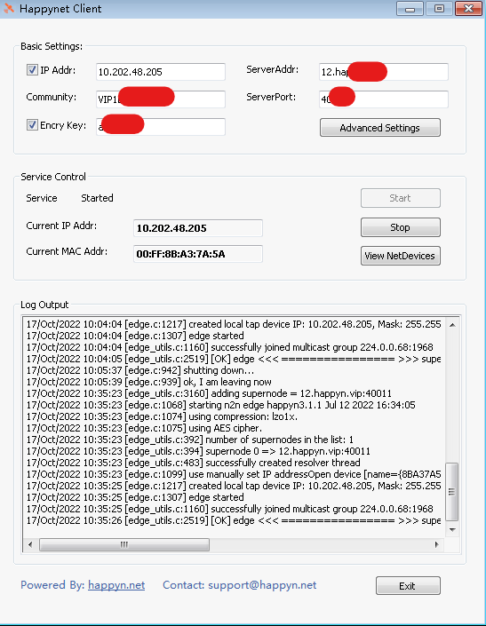
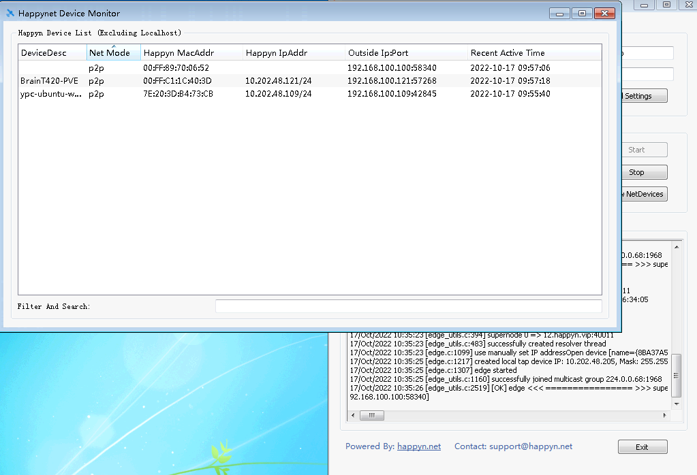
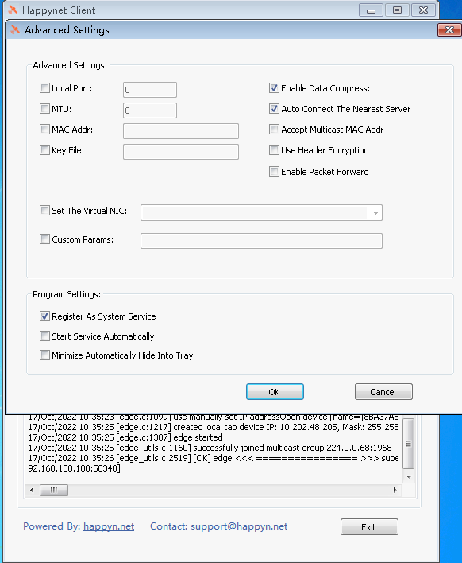

# README

#### [<a href="README_zh.md">中文</a>]

Happynet Windows Client is a GUI program for N2N Client packaging, for N2N users to provide easy to use interface control;

## Compatibility

Happynet Client is compatible with [N2N3.0](https://github.com/ntop/n2n/releases/tag/3.0)

## User Guide

1. download and install package, the package will auto set tuntap driver
2. set ip address, community, encry key, supernode host, supernode port
3. start service

The configuration is compatible with [n2n edge params](https://github.com/ntop/n2n/blob/dev/doc/ConfigurationFiles.md)

## ScreenShots

## Download

[happynet download](https://github.com/happynclient/happynwindows/releases)

## FAQ

#### Are there any plans for support previous version of n2n like v2.4 ?

By default, we currently only support N2N 3.0; If you are using an older version of N2N (such as N2N V2); You can also change the file a little by yourself to support, it's easy:

1. Prepare your N2N `edge.exe`

2. Rename your `edge.exe` to `happyneddge.exe` to replace happynet's default installation file: `C:\Program Files (x86)\happynet\happynedge.exe`

3. Most parameters of N2N V2 and V3 are compatible. If there are special parameters that are not compatible, you can go to "Custom Parameters" in `Advanced Settings` to set your own parameters

## License:

[COPYRIGHT.GPL3](LICENSE)

## Powed by:

https://happyn.net

